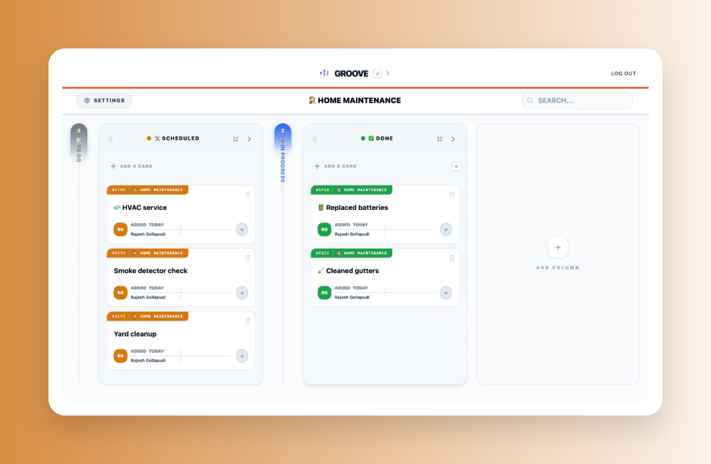

# Groove

Groove is a refined, high-performance Kanban board application built with React Router v7. It combines the sophisticated aesthetics of [fizzy.do](https://fizzy.do) with the core Kanban principles established in Ryan Florence's Trellix work.




## ✨ Features

- **Unlimited Board Management**: Create, customize, and organize an unlimited number of boards with distinct color identities. Powered by a local-first SQLite database for maximum portability and speed.
- **Sophisticated Column Interactions**:
  - **Expand/Collapse**: Focus on what matters by collapsing columns into minimalist "guitar strings".
  - **Guitar Strings**: Collapsed columns feature vertical progress indicators inspired by Fizzy's unique design language.
  - **Dynamic Reordering**: Fluid drag-and-drop for both columns and cards.
- **Advanced Card System**:
  - **Rich Content**: Full card detail view with support for descriptions and metadata.
  - **Assignments**: Assign team members to cards for clear ownership.
  - **Comments**: Track discussions directly on cards.
- **Mobile-Responsive by Design**:
  - **Horizontal Guitar Cards**: A specialized mobile view that converts vertical columns into horizontal progress cards.
  - **Proportional Gradients**: Mobile cards show proportional gradient fills based on card count.
  - **Optimized Navigation**: Dedicated column detail views for small screens.
- **Productivity First**:
    - **Keyboard Shortcuts**: Work at the speed of thought with handy shortcuts:
      - `j`: Global **Jump to Board** menu. Quickly switch between boards from anywhere.
      - `c`: **Quick Add Card** (on the default column). Focus on capturing ideas instantly.
      - `f`: **Focus Search** in the board header to filter your view.
    - **Intelligent Templates**: Jumpstart any project with curated board structures:
      - **Agile/Sprint**: Optimized workflows for software development teams.
      - **Eisenhower Matrix**: Prioritize tasks by urgency and importance.
      - **Hiring/Sales Pipelines**: Track candidates or leads through multi-stage funnels.
      - **Content/Reading Lists**: Manage creative workflows and personal knowledge.
    - **Optimistic UI**: Instant updates for a zero-latency feel using React Router's fetchers.

## 🔐 Simplified Permission Model

Groove uses a streamlined 2-role permission system designed for clarity and ease of use:

### Roles

| Role       | Permissions                                                                                                              |
| ---------- | ------------------------------------------------------------------------------------------------------------------------ |
| **Owner**  | Full control: Create/delete columns, change column colors, manage members, invite users, delete board, update board name |
| **Editor** | Limited control: Create/edit/delete own cards, edit column names, assign cards to team members                           |

### Permission Matrix

| Action               | Owner | Editor |
| -------------------- | ----- | ------ |
| Create columns       | ✅    | ❌     |
| Delete columns       | ✅    | ❌     |
| Change column colors | ✅    | ❌     |
| Edit column names    | ✅    | ✅     |
| Reorder columns      | ✅    | ❌     |
| Create cards         | ✅    | ✅     |
| Edit cards           | ✅    | ✅     |
| Delete own cards     | ✅    | ✅     |
| Delete others' cards | ✅    | ❌     |
| Assign cards         | ✅    | ✅     |
| Invite team members  | ✅    | ❌     |
| Remove members       | ✅    | ❌     |
| Delete board         | ✅    | ❌     |
| Update board name    | ✅    | ❌     |

### Membership

- **Board Owner**: The user who created the board has full owner permissions
- **Editors**: Team members invited to the board are granted editor role by default
- **Access Control**: Only board owners and invited members can view board details. Non-members receive a 403 Forbidden error.

### Implementation

Permissions are centrally managed in `app/utils/permissions.ts` with these key functions:

- `assertBoardAccess(board, accountId)`: Validates board membership, throws 403 if denied
- Permission gates like `canCreateColumn()`, `canDeleteCard()`, etc. for fine-grained control
- `getPermissionErrorMessage()` for consistent user-facing error messages

## 🛠️ Tech Stack

- **Framework**: [React Router v7](https://reactrouter.com/) (Vite-based)
- **Language**: [TypeScript](https://www.typescriptlang.org/) (Strict mode)
- **Database**: [Prisma](https://www.prisma.io/) with SQLite
- **Styling**: [Tailwind CSS](https://tailwindcss.com/)
- **State Management**: React Router Loaders, Actions, and Fetchers
- **Build Tool**: [Vite](https://vitejs.dev/)
- **Linting/Formatting**: [oxlint](https://oxlint.dev/) and [oxfmt](https://github.com/oxc-project/oxfmt)

## 🚀 Getting Started

### Prerequisites

- Node.js (Latest LTS recommended)
- npm or pnpm

### Installation

1. Clone the repository:

   ```bash
   git clone https://github.com/your-username/groove.git
   cd groove
   ```

2. Install dependencies:

   ```bash
   npm install
   ```

3. Set up the database:

   ```bash
   npx prisma migrate dev
   ```

4. Start the development server:
   ```bash
   npm run dev
   ```

## 📜 Development Commands

- `npm run dev`: Start development server
- `npm run build`: Build for production
- `npm run start`: Start production server
- `npm run typecheck`: Run TypeScript compiler check
- `npm run lint`: Run oxlint for fast code analysis
- `npm run format`: Format code using oxfmt
- `npm test`: Run vitest suite

## 🎨 Design Philosophy

Groove aims for a "Goldilocks" balance between a simple list and a complex project management tool. It uses verticality and color-mixed gradients to provide subconscious cues about project health and progress.

## ❤️ Credits

Inspired by:

- **Fizzy** ([fizzy.do](https://fizzy.do)): For the unique "guitar string" aesthetic and proportional progress design.
- **Ryan Florence's Trellix**: For the foundational Kanban logic and React Router patterns.

---

Built with precision and rhythm.
